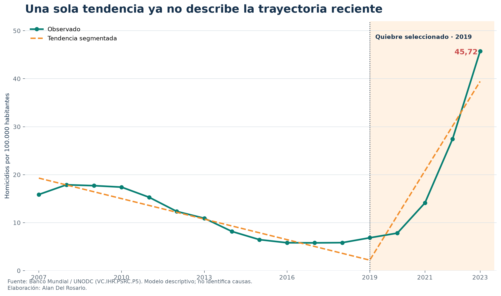
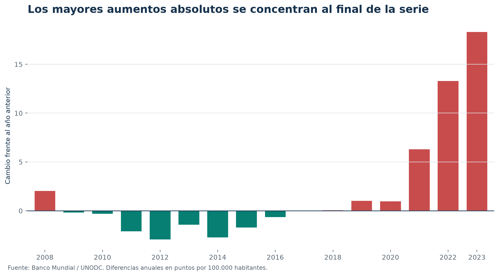
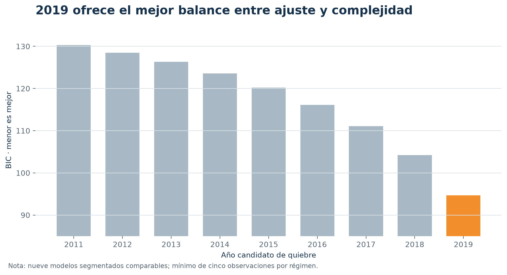

> **Estado editorial.** Demostración final pendiente de revisión independiente y aprobación de Alan. No publicar como resultado definitivo.

# Planteamiento

La tasa de homicidios es una señal agregada del nivel de violencia letal, pero su trayectoria puede contener regímenes distintos. Este documento pregunta si una tendencia única resume el período 2007–2023 o si los datos favorecen un cambio de pendiente. No estima causas ni efectos de política.

# Datos

Se utiliza World Development Indicators, indicador `VC.IHR.PSRC.P5`, cuya fuente primaria es UNODC. El indicador mide homicidios intencionales por cada 100.000 habitantes [@worldbank_metadata]. El tramo 2007–2023 contiene 17 observaciones continuas; no se imputan los años ausentes anteriores.

{width=95%}

# Método

Para cada fecha candidata $\tau$ entre 2011 y 2019 se estima una tendencia continua segmentada:

$$y_t = \alpha + \beta_1 t + \beta_2(t-\tau)_+ + \varepsilon_t.$$

La fecha seleccionada minimiza el BIC. El enfoque sigue la lógica de estimar fechas de cambio mediante minimización global del error, con penalización por complejidad [@bai_perron_2003]. Dada la muestra pequeña, se reporta como diagnóstico exploratorio y se contrasta en logaritmos y leave-one-out.

# Resultados





{width=92%}

# Robustez

La especificación logarítmica también selecciona 2019. La validación leave-one-out reestima los nueve candidatos después de retirar una observación y permite comprobar cuánto depende la fecha de cada punto individual.

{width=88%}

# Interpretación y límites

El modelo segmentado describe mejor la trayectoria que una recta única. Esto no significa que 2019 sea una causa ni que un evento particular explique el cambio. La muestra es pequeña; el dato es nacional y anual; el último período observado es 2023; y futuras revisiones pueden modificar la serie.

# Implicación ejecutiva

El promedio de largo plazo dejó de ser una referencia suficiente para dimensionar el régimen reciente. La siguiente inversión analítica debe dirigirse a datos subnacionales y de mayor frecuencia, con modalidad y perfil de víctima, antes de formular recomendaciones de intervención.

# Reproducibilidad

Datos, metadatos, scripts, pruebas, resultados y figuras se versionan juntos. El informe Research, el dashboard y este PDF consumen los mismos outputs derivados.

# Apéndice: selección de modelos

La tabla presenta la grilla completa de fechas candidatas. Todos los modelos tienen tres parámetros y se estiman sobre la misma muestra, por lo que sus BIC son directamente comparables.


