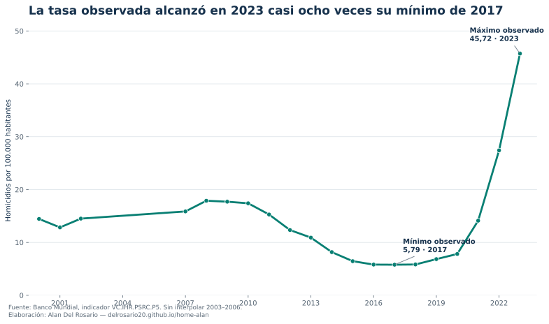

::: {.callout-warning icon=false}
## Estado editorial

**Borrador técnico, no aprobado para publicación.** La cadena reproducible y las comprobaciones automáticas fueron ejecutadas; faltan la revisión independiente de cuatro ojos y la aprobación explícita de Alan.
:::

## Qué pregunta responde

¿Cómo cambió la tasa de homicidios intencionales reportada para Ecuador entre 2000 y 2023, y qué tan grande fue la diferencia entre el mínimo y el máximo observados?

Este es un análisis **descriptivo**. No estima el efecto de una política, del crimen organizado ni de otra causa específica. Por ello no formula una hipótesis causal: documenta magnitud, temporalidad, cobertura y límites de una serie oficial.

## El resultado



{fig-alt="Serie de la tasa de homicidios en Ecuador. Desciende hasta 5,79 en 2017 y aumenta hasta 45,72 en 2023. No hay observaciones entre 2003 y 2006."}

La comparación resume una ruptura temporal muy grande, pero **no identifica por sí sola qué la explica**. Convertir la coincidencia temporal con cambios sociales o criminales en una conclusión causal requeriría otro diseño, variables explicativas y pruebas de robustez.

## Qué puede —y qué no puede— concluirse

La serie permite afirmar que el máximo observado es muy superior al mínimo observado y ubicar ambos años. No permite atribuir el aumento a una causa, comparar tipos de homicidio ni inferir diferencias provinciales: el indicador es nacional y agregado.

Además, el Banco Mundial no reporta valores para 2003–2006 dentro del período solicitado. Esos años **no fueron interpolados ni completados**. La línea conecta 2002 con 2007 únicamente como recurso visual; no representa observaciones intermedias.

## Trazabilidad del dato



- **Fuente:** [Banco Mundial, World Development Indicators](https://data.worldbank.org/indicator/VC.IHR.PSRC.P5?locations=EC).
- **Indicador:** `VC.IHR.PSRC.P5`, homicidios intencionales por cada 100.000 habitantes.
- **Cobertura solicitada:** Ecuador, 2000–2025; último dato no nulo: 2023.
- **Fecha de descarga:** 5 de julio de 2026; la API reportó actualización al 1 de julio de 2026.
- **Descarga reproducible:** [script 01](scripts/01_descarga.py) mediante la [API oficial del Banco Mundial](https://api.worldbank.org/v2/country/ECU/indicator/VC.IHR.PSRC.P5?format=json&per_page=100&date=2000:2025).

## Cómo reproducirlo

Desde la raíz de este post:

```powershell
./reproducir.ps1
```

La cadena descarga la fuente, valida el esquema, calcula los indicadores, genera el gráfico, ejecuta pruebas unitarias, verifica el lenguaje y renderiza el documento. Los resultados textuales se insertan desde archivos generados por código: no se transcriben manualmente.

## Límites

- Los datos agregados nacionales ocultan heterogeneidad territorial y demográfica.
- La fuente compila estadísticas reportadas por los países; sus revisiones pueden cambiar la serie.
- Cuatro años del intervalo no tienen observación y no se imputan.
- La comparación mínimo–máximo describe extremos observados; no constituye una estimación causal ni un pronóstico.

## Registro de calidad

El detalle de las puertas cerradas y pendientes consta en el [checklist de esta pieza](qa/CHECKLIST.md). La metodología completa del portafolio está en el [Protocolo de Calidad](../../../_gobernanza/PROTOCOLO_CALIDAD.md).
