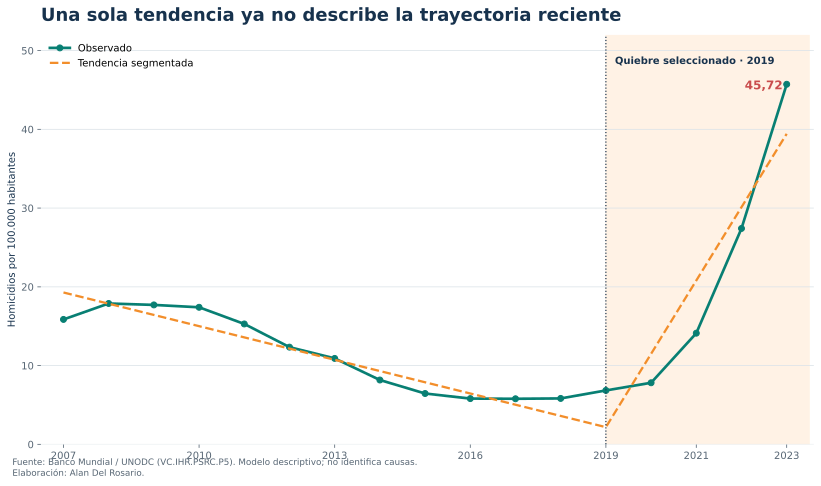
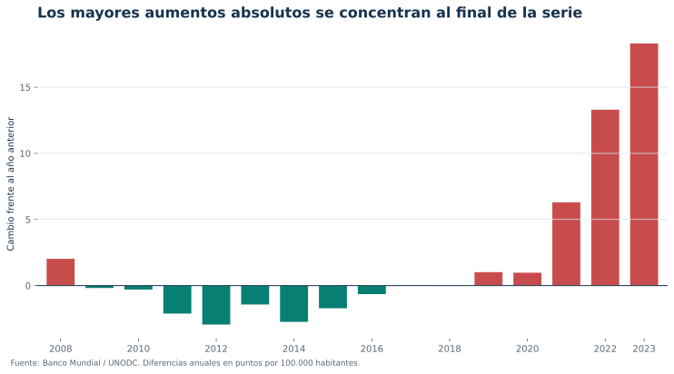
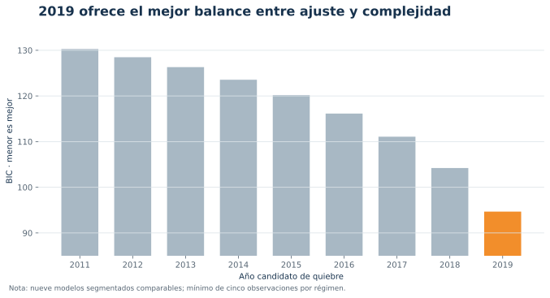

::: {.research-context-bar}
[Investigación](homicidios-research.qmd) [Tablero](homicidios-dashboard.qmd) [Caso](homicidios.qmd) [Informe PDF](../output/pdf/research-homicidios-ecuador.pdf)
:::

::: {.research-document}

## Resumen

Este estudio examina si una tendencia lineal única describe adecuadamente la tasa anual de homicidios intencionales de Ecuador entre 2007 y 2023. Se compara una tendencia global con modelos lineales segmentados para nueve fechas candidatas de quiebre, manteniendo un mínimo de cinco observaciones por régimen. La selección se realiza mediante el Criterio de Información Bayesiano (BIC) y se somete a sensibilidad en logaritmos y leave-one-out. El ejercicio identifica un cambio de pendiente en 2019 y una aceleración posterior pronunciada. El resultado es descriptivo: detecta inestabilidad en la trayectoria, pero no identifica sus causas.

**Palabras clave:** homicidios, cambio estructural, tendencia segmentada, seguridad, Ecuador.  
**JEL:** C22, I18, K42.

## Hallazgos principales



## Pregunta y marco analítico

La pregunta es deliberadamente acotada: **¿una sola tendencia temporal resume la trayectoria observada o los datos favorecen dos regímenes con pendientes distintas?** No se estima el efecto de una política ni se adjudica el cambio a mercados ilícitos, instituciones o condiciones sociales. Esas explicaciones requieren covariables, teoría causal y un diseño de identificación distinto.

El concepto de homicidio intencional corresponde a una muerte ilícita infligida con intención de causar muerte o lesión grave; el indicador anual es agregado por UNODC y expresado por 100.000 habitantes [@worldbank_metadata].

## Datos

La fuente es World Development Indicators del Banco Mundial, indicador `VC.IHR.PSRC.P5`, construido a partir de UNODC. Se utiliza 2007–2023 porque constituye el tramo continuo disponible: 17 observaciones anuales, sin imputación. Los años 2003–2006 quedan fuera del modelo por ausencia de dato. La descarga se ejecutó el 5 de julio de 2026 y la API reportó actualización al 1 de julio de 2026.

{fig-alt="Serie 2007 a 2023 y tendencia segmentada. El modelo selecciona 2019 como quiebre de pendiente."}

## Método

Para cada año candidato $\tau$ se estima:

$$
y_t = \alpha + \beta_1 t + \beta_2 (t-\tau)_+ + \varepsilon_t,
$$

donde $(t-\tau)_+=\max(0,t-\tau)$. La pendiente anterior al quiebre es $\beta_1$ y la posterior es $\beta_1+\beta_2$. Se consideran nueve fechas entre 2011 y 2019; la restricción deja al menos cinco observaciones por régimen. La fecha seleccionada minimiza el BIC, una aplicación exploratoria del principio de elegir quiebres como minimizadores globales del error penalizado por complejidad [@bai_perron_2003].

Por el tamaño reducido de la muestra, el ejercicio no se presenta como una prueba asintótica definitiva. Los intervalos usan covarianza HC1 y distribución t; la robustez se evalúa reestimando en logaritmos y retirando una observación por vez.

## Resultados





La diferencia estadística es grande, pero el intervalo posterior refleja que solo hay cinco observaciones en el régimen reciente.

{fig-alt="Barras de cambios anuales en la tasa. Los mayores aumentos aparecen entre 2021 y 2023."}

## Robustez

La especificación logarítmica vuelve a seleccionar 2019. En la validación leave-one-out, que reestima todos los candidatos tras retirar cada año, 2019 conserva la mayor frecuencia de selección. El gráfico siguiente muestra que también es el mínimo de BIC en niveles; 2018 y 2017 son alternativas progresivamente menos favorecidas.

{fig-alt="BIC de modelos con quiebres candidatos de 2011 a 2019. El menor valor corresponde a 2019."}

## Discusión

El resultado central no es que “2019 causó” el aumento, sino que una representación con dos pendientes describe mucho mejor el patrón observado que una tendencia única. Para la gestión, esto implica que promedios de largo plazo pueden ocultar la velocidad del régimen reciente. Para investigación, delimita el siguiente paso: integrar registros subnacionales y variables sobre modalidad, territorio y perfil de víctimas para contrastar mecanismos específicos.

## Limitaciones

1. Diecisiete observaciones son una base pequeña para inferencia de series temporales.
2. La tasa nacional oculta heterogeneidad territorial y por tipo de homicidio.
3. La fecha de quiebre se selecciona dentro de una grilla; no representa una fecha causal.
4. El último dato es 2023, por lo que el tablero no describe 2024–2026.
5. Las revisiones de UNODC o de la fuente nacional pueden modificar la serie.

## Reproducibilidad

Los datos, el código y las figuras de este documento son reproducibles a partir de la fuente pública citada. La investigación y el tablero ejecutivo se derivan siempre de los mismos resultados, por lo que ambos son consistentes entre sí.

## Referencias {.unnumbered}

:::
